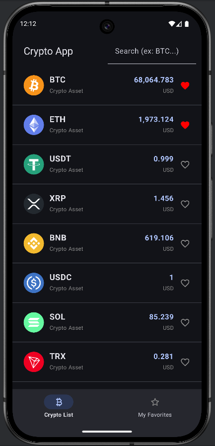
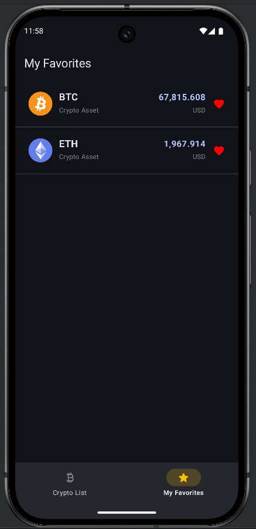
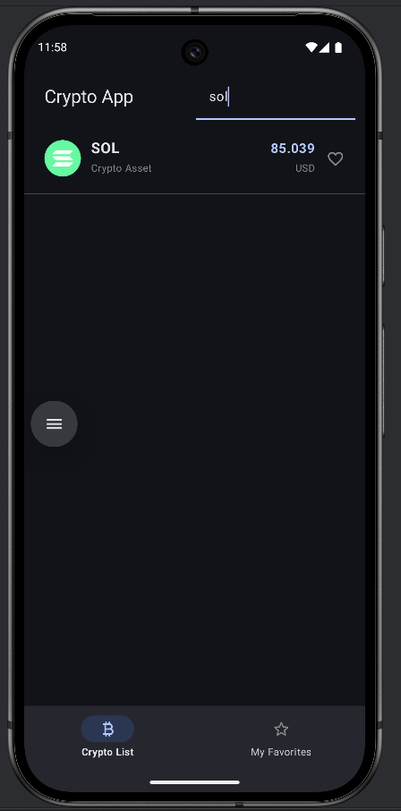
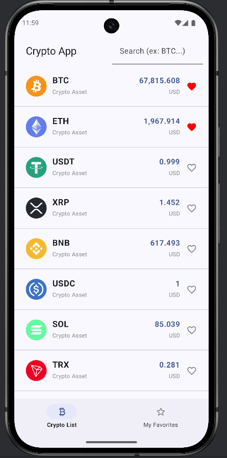
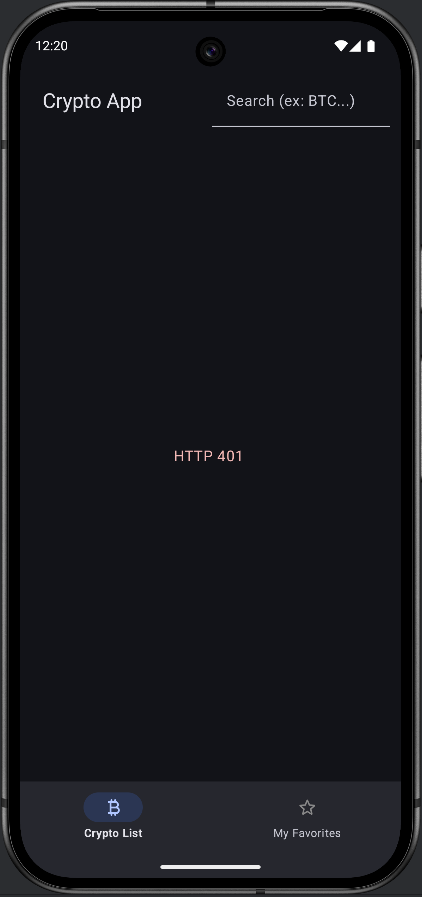

## Crypto App

Android için Jetpack Compose ile geliştirilmiş, kripto para listesini gösteren ve favori kriptoları yerel veritabanında saklayan bir örnek uygulamadır. Projeye başlarken, Tunahan Demir’in YouTube üzerindeki ilgili eğitim videosundan esinlenilmiştir.

Bu proje, özellikle **Android geliştirme** ve **REST API tüketimi** konularında kendimi geliştirmek amacıyla hazırlanmış olup, modern Android teknolojileri (Compose, Hilt, Room, Retrofit, Navigation Compose) ile basit fakat üretim mantığına yakın bir mimari örneği sunmaktadır.

---

### İçindekiler

- [Özellikler](#özellikler)
- [Ekranlar](#ekranlar)
- [Kullanılan Teknolojiler ve Mimarî](#kullanılan-teknolojiler-ve-mimarî)
- [Proje Yapısı (Özet)](#proje-yapısı-özet)
- [Kurulum & Çalıştırma](#kurulum--çalıştırma)
- [API Hakkında Notlar](#api-hakkında-notlar)

---

### Özellikler

- **Kripto para listesi**: API’den çekilen kripto verilerini liste halinde gösterir.
- **Arama**: Üst bardaki arama alanı ile sembol/isim bazlı filtreleme (örn. `BTC`).
- **Yeniden yükleme (Pull to refresh)**: Listeyi aşağı çekerek verileri yeniden yükleme.
- **Favorilere ekleme / çıkarma**:
  - Listeden kriptoları favorilere ekleyip çıkarabilirsiniz.
  - Favoriler Room veritabanında saklanır, uygulama yeniden açıldığında da korunur.
- **Favori ekranı**:
  - Alt navigation bar’dan erişilen “My Favorites” ekranında yalnızca favorilere eklenen kriptolar listelenir.
  - Bu ekranda da favoriden çıkarma işlemleri yapılabilir.
- **Modern UI**:
  - Jetpack Compose,
  - Material 3 bileşenleri,
  - Alt navigation bar ile 2 sekmeli yapı (Crypto List / My Favorites).

---

### Ekranlar

- **Crypto List**
  - Uygulamanın açılış ekranı.
  - Kripto listesini, durumuna göre loading / hata mesajlarını gösterir.
  - Arama ve pull-to-refresh desteği vardır.
- **My Favorites**
  - Kullanıcının favori olarak işaretlediği kriptoları gösterir.
  - Liste boş ise kullanıcıya bilgilendirici mesaj gösterilir.

### Ekran Görüntüleri


#### Crypto List (Dark Theme)


#### My Favorites (Dark Theme)


#### Arama (Search)


#### Crypto List (Light Theme)


#### HTTP 401 Hata Ekranı
Bu ekran görüntüsü, geçersiz veya eksik API anahtarı kullanıldığında alınan **HTTP 401 Unauthorized** hatasını örneklemektedir.


---

### Kullanılan Teknolojiler ve Mimarî

- **Dil & Platform**
  - Kotlin
  - Android (minSdk = 27, targetSdk = 36)
- **UI**
  - Jetpack Compose
  - Material 3
  - Accompanist SwipeRefresh
- **Mimarî**
  - MVVM benzeri, katmanlı yapı:
    - `data` (remote + local + mapper)
    - `domain` (model, repository interface, usecase’ler)
    - `presentation` (ViewModel’ler, ekranlar, UI state)
- **DI**
  - Dagger Hilt (`@HiltAndroidApp`, `@AndroidEntryPoint`, `@Module` + `@InstallIn`)
- **Veri Katmanı**
  - **Remote**: Retrofit + Gson + OkHttp
  - **Local**: Room (FavoriteEntity, FavoriteDao, CryptoDatabase)
- **Navigation**
  - Navigation Compose
  - Alt bar ile `CryptoList` ve `FavoriteList` rotaları
- **Diğer**
  - Coil (görsel yükleme için)
  - Material Icons Extended

---

### Proje Yapısı (Özet)

- `app/src/main/java/com/yusufcanyenilmez/crypto_app`
  - **`CryptoApp.kt`**  
    - `@HiltAndroidApp` ile işaretlenmiş `Application` sınıfı.
  - **`presentation/`**
    - `MainActivity.kt`:  
      - `Scaffold` + alt navigation bar ile 2 ekran arasında geçiş.
    - `cryptos/`
      - `CryptoScreen.kt`: Kripto listesinin gösterildiği ekran.
      - `CryptoViewModel.kt`, `CryptoState.kt`: Liste, loading, error, arama vb. durum yönetimi.
      - `components/CryptoItem.kt`: Her bir kripto satırı için Compose bileşeni.
    - `favorite_list/`
      - `FavoriteScreen.kt`: Favoriler ekranı.
      - `FavoriteViewModel.kt`, `FavoriteState.kt`.
    - `ui/theme/`:
      - Tema, renk ve tipografi dosyaları.
  - **`data/`**
    - `remote/`
      - `CryptoAPI.kt`: Retrofit API interface’i.
      - `dto/`: API’den gelen response modelleri (`CryptoDto`, `Result` vs.).
    - `local/`
      - `FavoriteEntity.kt`, `FavoriteDao.kt`, `CryptoDatabase.kt` (Room).
    - `repository/`
      - `CryptoRepositoryImpl.kt`: Remote + Local katmanını birleştiren repository implementasyonu.
    - `mapper/`
      - `CryptoMapper.kt`: DTO -> domain model dönüşümleri.
  - **`domain/`**
    - `model/Crypto.kt`: Uygulamanın domain modeli.
    - `repository/CryptoRepository.kt`: Repository arayüzü.
    - `usecase/`: `GetCryptoUseCase`, `GetFavoritesUseCase`, `ToggleFavoriteUseCase` vb.
  - **`di/`**
    - `CryptoModule.kt`:  
      - Retrofit, Room DB, DAO ve Repository için Hilt modülleri.
  - **`util/`**
    - `Screen.kt`: Navigation rotaları.
    - `Resource.kt`: Loading / Success / Error durumlarını temsil eden sealed class.
    - `Constants.kt`: `BASE_URL`, `CONTENT_TYPE`, `API_KEY` gibi sabitler.

---

### Kurulum & Çalıştırma

1. **Gereksinimler**
   - Android Studio (Giraffe/Flamingo veya üstü önerilir)
   - JDK 11
   - Android SDK (en az API 27, target 36)
2. **Projeyi Klonlayın**
   ```bash
   git clone <https://github.com/yusufcanyenilmez/Crypto_App.git>
   cd Crypto_App
   ```
3. **Projeyi Android Studio ile Açın**
   - `File > Open` ile proje klasörünü seçin.
   - Gradle sync tamamlanana kadar bekleyin.
4. **API Anahtarı Yapılandırması (Önemli)**
   - Uygulama `https://api.collectapi.com` üzerinden veri çekmektedir.
   - Kendi hesabınızla CollectAPI üzerinden bir API key oluşturun.
   - Ardından, bu anahtarı **kaynak koda yazmadan**, proje kökündeki `local.properties` dosyası üzerinden uygulamaya iletin:
     1. Proje kök dizininde bulunan (ve Git’e eklenmeyen) `local.properties` dosyasına aşağıdaki satırı ekleyin:
        ```properties
        COLLECT_API_KEY=apikey SIZIN_API_KEYINIZ
        ```
     2. `app/build.gradle.kts` dosyası, `local.properties` içindeki bu değeri okuyarak `BuildConfig.API_KEY` sabitini üretir ve `CryptoAPI` içinde `Authorization` header’ında kullanır.
   - Böylece gerçek API anahtarınız **versiyon kontrolüne girmeden**, sadece yerel geliştirme ortamınızda saklanmış olur.
5. **Uygulamayı Çalıştırın**
   - Bir emulator veya gerçek cihaz seçin.
   - Android Studio’dan `Run` butonu ile `app` modülünü çalıştırın.

---

### API Hakkında Notlar

- **Base URL**: `https://api.collectapi.com`
- **Endpoint**: `economy/cripto`
- İsteklerde:
  - `Content-Type: application/json`
  - `Authorization: apikey <SİZİN_API_KEYİNİZ>` başlıkları kullanılır.


